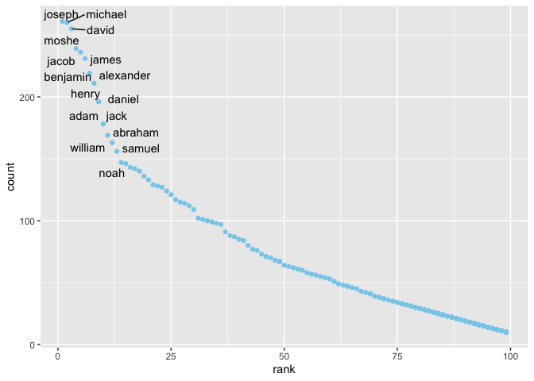

p8105\_hw2\_js5959
================
Junzhe Shao
10/9/2021

## Problem 1

### read excel sheet “Mr. Trash Wheel” and do the data cleaning

``` r
#read excel sheet "Mr. Trash Wheel" and do the data cleaning
mr_tw_dt = read_excel("Trash-Wheel-Collection-Totals-7-2020-2.xlsx", sheet = "Mr. Trash Wheel", skip = 1) %>% 
  janitor::clean_names() %>% 
  select(-c(x15,x16,x17)) %>% # remove extra columns
  filter(dumpster != "Grand Total") %>% 
  drop_na(dumpster) %>% 
  mutate(
    sports_balls = round(sports_balls)
  )
```

    ## New names:
    ## * `` -> ...15
    ## * `` -> ...16
    ## * `` -> ...17

``` r
#display first ten rows 
kable(mr_tw_dt[1:10,])
```

| dumpster | month | year | date       | weight\_tons | volume\_cubic\_yards | plastic\_bottles | polystyrene | cigarette\_butts | glass\_bottles | grocery\_bags | chip\_bags | sports\_balls | homes\_powered |
|:---------|:------|-----:|:-----------|-------------:|---------------------:|-----------------:|------------:|-----------------:|---------------:|--------------:|-----------:|--------------:|---------------:|
| 1        | May   | 2014 | 2014-05-16 |         4.31 |                   18 |             1450 |        1820 |           126000 |             72 |           584 |       1162 |             7 |              0 |
| 2        | May   | 2014 | 2014-05-16 |         2.74 |                   13 |             1120 |        1030 |            91000 |             42 |           496 |        874 |             5 |              0 |
| 3        | May   | 2014 | 2014-05-16 |         3.45 |                   15 |             2450 |        3100 |           105000 |             50 |          1080 |       2032 |             6 |              0 |
| 4        | May   | 2014 | 2014-05-17 |         3.10 |                   15 |             2380 |        2730 |           100000 |             52 |           896 |       1971 |             6 |              0 |
| 5        | May   | 2014 | 2014-05-17 |         4.06 |                   18 |              980 |         870 |           120000 |             72 |           368 |        753 |             7 |              0 |
| 6        | May   | 2014 | 2014-05-20 |         2.71 |                   13 |             1430 |        2140 |            90000 |             46 |           672 |       1144 |             5 |              0 |
| 7        | May   | 2014 | 2014-05-21 |         1.91 |                    8 |              910 |        1090 |            56000 |             32 |           416 |        692 |             3 |              0 |
| 8        | May   | 2014 | 2014-05-28 |         3.70 |                   16 |             3580 |        4310 |           112000 |             58 |          1552 |       3015 |             6 |              0 |
| 9        | June  | 2014 | 2014-06-05 |         2.52 |                   14 |             2400 |        2790 |            98000 |             49 |           984 |       1988 |             6 |              0 |
| 10       | June  | 2014 | 2014-06-11 |         3.76 |                   18 |             1340 |        1730 |           130000 |             75 |           448 |       1066 |             7 |              0 |

### clean precipitation for 2018 and 2019

``` r
# clean precipitation for 2018 and 2019
pr_19_dt = read_excel("Trash-Wheel-Collection-Totals-7-2020-2.xlsx", sheet = "2019 Precipitation", skip = 1) %>% 
  janitor::clean_names() %>% 
  drop_na(month) %>% 
  mutate(
    month = month.name[month],
    year = 2019)
pr_18_dt = read_excel("Trash-Wheel-Collection-Totals-7-2020-2.xlsx", sheet = "2018 Precipitation", skip = 1) %>% 
  janitor::clean_names() %>% 
  drop_na(month) %>% 
  mutate(
    month = month.name[month],
    year = 2018)
pr_dt = bind_rows(pr_19_dt,pr_18_dt)
kable(pr_dt)
```

| month     | total | year |
|:----------|------:|-----:|
| January   |  3.10 | 2019 |
| February  |  3.64 | 2019 |
| March     |  4.47 | 2019 |
| April     |  1.46 | 2019 |
| May       |  3.58 | 2019 |
| June      |  0.42 | 2019 |
| July      |  3.85 | 2019 |
| August    |  2.39 | 2019 |
| September |  0.16 | 2019 |
| October   |  5.45 | 2019 |
| November  |  1.86 | 2019 |
| December  |  3.57 | 2019 |
| January   |  0.94 | 2018 |
| February  |  4.80 | 2018 |
| March     |  2.69 | 2018 |
| April     |  4.69 | 2018 |
| May       |  9.27 | 2018 |
| June      |  4.77 | 2018 |
| July      | 10.20 | 2018 |
| August    |  6.45 | 2018 |
| September | 10.47 | 2018 |
| October   |  2.12 | 2018 |
| November  |  7.82 | 2018 |
| December  |  6.11 | 2018 |

### A description of both resulting datasets:

observation of cleaned Mr. Trash Wheel data is 453, variables in that
dataset indicating the a summary of date, total amount of trash
collected and their specific types. observation of combined 2018 and
2019 Precipitation data is 24 month. The total Precipitation of 2018 is
70.33 the medium number of sports balls in a dumpster in 2019 is 9

## Problem 2

### clean the data in pols-month.csv.

``` r
pols_month_dt = read_csv("./fivethirtyeight_datasets/pols-month.csv") %>% 
  separate(mon,c("year","month","day")) %>% 
  mutate(
    month = month.name[as.numeric(month)],
    president = ifelse(prez_gop == 0, "dem","gop")# replace 0 with dem 
  ) %>% 
  select(-c(prez_dem,prez_gop,day))#remove columns
```

    ## Rows: 822 Columns: 9

    ## ── Column specification ────────────────────────────────────────────────────────
    ## Delimiter: ","
    ## dbl  (8): prez_gop, gov_gop, sen_gop, rep_gop, prez_dem, gov_dem, sen_dem, r...
    ## date (1): mon

    ## 
    ## ℹ Use `spec()` to retrieve the full column specification for this data.
    ## ℹ Specify the column types or set `show_col_types = FALSE` to quiet this message.

``` r
#display first ten rows
kable(pols_month_dt[1:10,])
```

| year | month     | gov\_gop | sen\_gop | rep\_gop | gov\_dem | sen\_dem | rep\_dem | president |
|:-----|:----------|---------:|---------:|---------:|---------:|---------:|---------:|:----------|
| 1947 | January   |       23 |       51 |      253 |       23 |       45 |      198 | dem       |
| 1947 | February  |       23 |       51 |      253 |       23 |       45 |      198 | dem       |
| 1947 | March     |       23 |       51 |      253 |       23 |       45 |      198 | dem       |
| 1947 | April     |       23 |       51 |      253 |       23 |       45 |      198 | dem       |
| 1947 | May       |       23 |       51 |      253 |       23 |       45 |      198 | dem       |
| 1947 | June      |       23 |       51 |      253 |       23 |       45 |      198 | dem       |
| 1947 | July      |       23 |       51 |      253 |       23 |       45 |      198 | dem       |
| 1947 | August    |       23 |       51 |      253 |       23 |       45 |      198 | dem       |
| 1947 | September |       23 |       51 |      253 |       23 |       45 |      198 | dem       |
| 1947 | October   |       23 |       51 |      253 |       23 |       45 |      198 | dem       |

### clean snp.csv

``` r
snp_dt = read_csv("./fivethirtyeight_datasets/snp.csv") %>% 
  mutate(
    date = mdy(date)
  ) %>% 
  separate(date,c("year","month","day")) %>% 
  mutate(
    month = month.name[as.numeric(month)],
    year = as.numeric(year),
    year = ifelse(year > 2021,year-100,year),
    year = as.character(year)
  ) %>% 
  select(-day)
```

    ## Rows: 787 Columns: 2

    ## ── Column specification ────────────────────────────────────────────────────────
    ## Delimiter: ","
    ## chr (1): date
    ## dbl (1): close

    ## 
    ## ℹ Use `spec()` to retrieve the full column specification for this data.
    ## ℹ Specify the column types or set `show_col_types = FALSE` to quiet this message.

``` r
kable(snp_dt[1:10,])    
```

| year | month    |   close |
|:-----|:---------|--------:|
| 2015 | July     | 2079.65 |
| 2015 | June     | 2063.11 |
| 2015 | May      | 2107.39 |
| 2015 | April    | 2085.51 |
| 2015 | March    | 2067.89 |
| 2015 | February | 2104.50 |
| 2015 | January  | 1994.99 |
| 2014 | December | 2058.90 |
| 2014 | November | 2067.56 |
| 2014 | October  | 2018.05 |

### clean unemployment data

``` r
unemp_dt = read_csv("./fivethirtyeight_datasets/unemployment.csv") %>% 
    pivot_longer(
      Jan:Dec,
      names_to = "month", 
      values_to = "percentage_unemployment") %>% 
    mutate(date = str_c(Year, month, sep = "-"),
           date= ym(date)) %>% 
  separate(date, c("year", "month","day")) %>% 
  mutate(
    month = month.name[as.numeric(month)]
  ) %>% 
  select(-c(day,Year))
```

    ## Rows: 68 Columns: 13

    ## ── Column specification ────────────────────────────────────────────────────────
    ## Delimiter: ","
    ## dbl (13): Year, Jan, Feb, Mar, Apr, May, Jun, Jul, Aug, Sep, Oct, Nov, Dec

    ## 
    ## ℹ Use `spec()` to retrieve the full column specification for this data.
    ## ℹ Specify the column types or set `show_col_types = FALSE` to quiet this message.

``` r
kable(unemp_dt[1:10,])
```

| percentage\_unemployment | year | month     |
|-------------------------:|:-----|:----------|
|                      3.4 | 1948 | January   |
|                      3.8 | 1948 | February  |
|                      4.0 | 1948 | March     |
|                      3.9 | 1948 | April     |
|                      3.5 | 1948 | May       |
|                      3.6 | 1948 | June      |
|                      3.6 | 1948 | July      |
|                      3.9 | 1948 | August    |
|                      3.8 | 1948 | September |
|                      3.7 | 1948 | October   |

``` r
res_dt <- left_join(pols_month_dt, snp_dt,by =c("year"="year","month"="month"),na_matches="never")
res_dt <- left_join(res_dt, unemp_dt,by =c("year"="year","month"="month"),na_matches="never") %>% 
  arrange(year,month)# arrange by order of date
kable(res_dt[1:10,])
```

| year | month    | gov\_gop | sen\_gop | rep\_gop | gov\_dem | sen\_dem | rep\_dem | president | close | percentage\_unemployment |
|:-----|:---------|---------:|---------:|---------:|---------:|---------:|---------:|:----------|------:|-------------------------:|
| 1947 | April    |       23 |       51 |      253 |       23 |       45 |      198 | dem       |    NA |                       NA |
| 1947 | August   |       23 |       51 |      253 |       23 |       45 |      198 | dem       |    NA |                       NA |
| 1947 | December |       24 |       51 |      253 |       23 |       45 |      198 | dem       |    NA |                       NA |
| 1947 | February |       23 |       51 |      253 |       23 |       45 |      198 | dem       |    NA |                       NA |
| 1947 | January  |       23 |       51 |      253 |       23 |       45 |      198 | dem       |    NA |                       NA |
| 1947 | July     |       23 |       51 |      253 |       23 |       45 |      198 | dem       |    NA |                       NA |
| 1947 | June     |       23 |       51 |      253 |       23 |       45 |      198 | dem       |    NA |                       NA |
| 1947 | March    |       23 |       51 |      253 |       23 |       45 |      198 | dem       |    NA |                       NA |
| 1947 | May      |       23 |       51 |      253 |       23 |       45 |      198 | dem       |    NA |                       NA |
| 1947 | November |       24 |       51 |      253 |       23 |       45 |      198 | dem       |    NA |                       NA |

### A bref discription

The finial res\_dt dataset includes all three parts above.There are
indicator of whether the president was republican/democratic, the number
of republican/democratic governors/representatives/senators,closing
values of the S&P stock index and the unemployment rate and variables
indicating date.

## Problem3

### A basic data cleaning with notes in questions

``` r
#According to the note, we need to specify the ethnicity name and control the case of names.

pop_names_dt = read_csv("Popular_Baby_Names.csv") %>% 
  janitor::clean_names()%>% 
    separate(ethnicity, "ethinic", extra = "drop") %>% # ethinic dupicated remove
  mutate(
    childs_first_name = tolower(childs_first_name)# lower case
  ) %>% distinct()# remove duplicated rows
```

    ## Rows: 19418 Columns: 6

    ## ── Column specification ────────────────────────────────────────────────────────
    ## Delimiter: ","
    ## chr (3): Gender, Ethnicity, Child's First Name
    ## dbl (3): Year of Birth, Count, Rank

    ## 
    ## ℹ Use `spec()` to retrieve the full column specification for this data.
    ## ℹ Specify the column types or set `show_col_types = FALSE` to quiet this message.

There are 12181 entries after remove duplicated rows.

### female named with olivia

``` r
olivia_female_dt = pop_names_dt %>% 
  filter(childs_first_name == "olivia",gender == "FEMALE") %>% 
  select(-c(childs_first_name,gender,count)) %>% 
  pivot_wider(
    names_from = "year_of_birth",
    values_from = "rank")
kable(olivia_female_dt)
```

| ethinic  | 2016 | 2015 | 2014 | 2013 | 2012 | 2011 |
|:---------|-----:|-----:|-----:|-----:|-----:|-----:|
| ASIAN    |    1 |    1 |    1 |    3 |    3 |    4 |
| BLACK    |    8 |    4 |    8 |    6 |    8 |   10 |
| HISPANIC |   13 |   16 |   16 |   22 |   22 |   18 |
| WHITE    |    1 |    1 |    1 |    1 |    4 |    2 |

### The most popluar male man trending for all years

``` r
pop_male_name = pop_names_dt %>% 
  filter(rank == 1,gender == "MALE") %>% 
  select(-c(rank,gender,count)) %>% 
  pivot_wider(
    names_from = "year_of_birth",
    values_from = "childs_first_name"
  )
kable(pop_male_name)
```

| ethinic  | 2016   | 2015   | 2014   | 2013   | 2012   | 2011    |
|:---------|:-------|:-------|:-------|:-------|:-------|:--------|
| ASIAN    | ethan  | jayden | jayden | jayden | ryan   | ethan   |
| BLACK    | noah   | noah   | ethan  | ethan  | jayden | jayden  |
| HISPANIC | liam   | liam   | liam   | jayden | jayden | jayden  |
| WHITE    | joseph | david  | joseph | david  | joseph | michael |

### scatter plot for white male in 2016:

``` r
male_white_2016 = pop_names_dt %>% 
  filter(gender == "MALE",ethinic == "WHITE",year_of_birth == 2016) 

ggplot(male_white_2016, aes(x = rank, y = count)) +geom_point(colour = "skyblue") +geom_text_repel(label = male_white_2016$childs_first_name)# add not overlapping labels
```

    ## Warning: ggrepel: 348 unlabeled data points (too many overlaps). Consider
    ## increasing max.overlaps

<!-- -->
